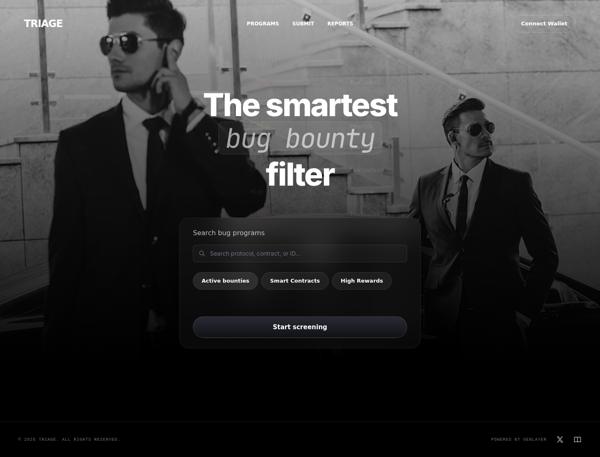
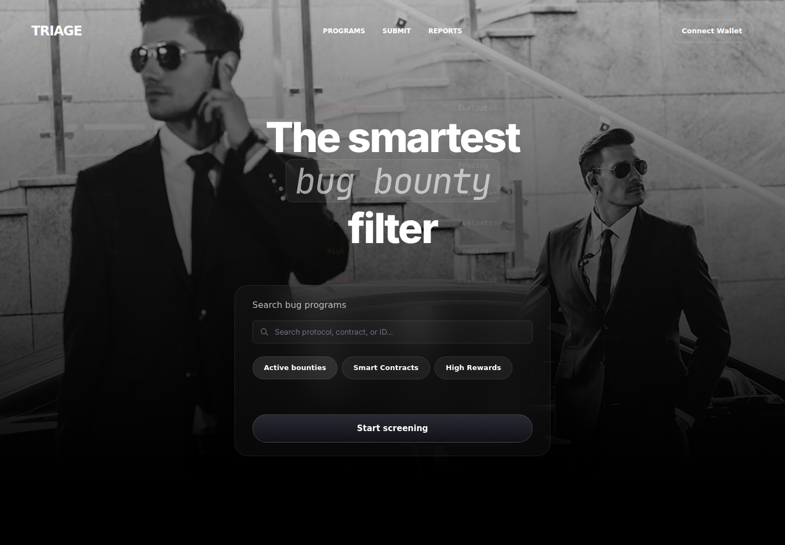
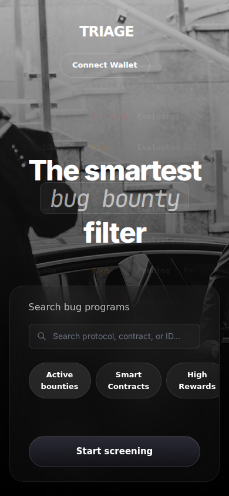
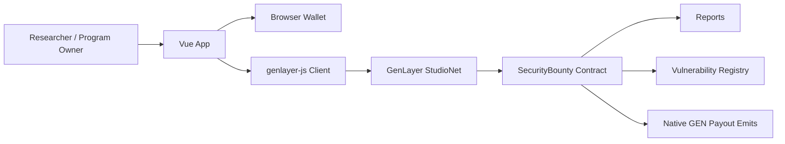

# Triage

AI-assisted bug bounty triage powered by GenLayer intelligent contracts.



## Why This Exists

Bug bounty programs are valuable, but first-pass triage is slow, repetitive, and hard to make consistent. Triage gives protocol teams a GenLayer-powered workflow for publishing bounty programs, collecting structured vulnerability reports, evaluating reports with AI consensus, tracking payout attempts, and building a queryable vulnerability registry.

## Features

- Create GenLayer bounty programs with scope, rules, safe harbor, disclosure policy, reward pools, max payout, and escrow tracking.
- Submit structured vulnerability reports with impact, reproduction steps, proof of concept, links, and remediation notes.
- Evaluate pending reports through GenLayer LLM consensus.
- Track accepted, rejected, duplicate, and pending reports across the global pipeline and connected wallet views.
- Emit native GEN payouts from accepted reports and expose payout retry status for operational follow-up.
- Query accepted findings through a shared vulnerability registry.
- View wallet address and wallet GEN balance inside the app shell.

## Product Screens

<p>
  
</p>

<p>
  
</p>

## Live Contract

| Network | Chain ID | Contract |
| --- | ---: | --- |
| GenLayer StudioNet | `61999` | `0x7860cc3Ff12FaCb93143Ca955e74Ab5dfbAFCEBa` |

## Tech Stack

- Frontend: Vue 3, Vite, Tailwind CSS
- Contract: GenLayer intelligent contract in Python
- Testing: `genlayer-test`, direct-mode tests, GenVM linter
- Wallet/runtime: `genlayer-js`, injected EVM wallet support
- Deployment target: GenLayer StudioNet for the app contract, Vercel-compatible static frontend

## Architecture



The public application deploys one production contract: `contracts/security_bounty.py`. A diagnostic `payout_probe.py` exists only for local/testnet investigation and is intentionally not part of the public launch.

## Quick Start

```bash
npm install
npm --prefix app install
cp .env.example app/.env
npm run dev
```

Open the local URL printed by Vite, usually `http://localhost:5173` or `http://localhost:5174`.

## Environment Variables

The frontend reads environment variables from `app/.env`.

| Variable | Required | Description |
|---|---:|---|
| `VITE_CONTRACT_ADDRESS` | Yes | StudioNet `SecurityBounty` contract address used by the app. |
| `VITE_STUDIO_URL` | Yes | GenLayer StudioNet RPC endpoint. Defaults to `https://studio.genlayer.com/api`. |

## Scripts

| Command | Description |
|---|---|
| `npm run dev` | Start the Vue/Vite dev server. |
| `npm run build` | Build the frontend for production. |
| `npm run preview` | Preview the production build locally. |
| `npm run test:contracts` | Lint and direct-test the GenLayer contract. |

## Verification Status

- Contract lint and direct tests: passing locally with `./scripts/check-security-bounty.sh`.
- Frontend production build: passing locally with `npm run build`.
- StudioNet patched redeploy: submitted, but deploy transactions are currently pending on StudioNet. The frontend remains configured to the last known readable StudioNet contract until a patched deploy is accepted and read-tested.
- `npm audit --registry=https://registry.npmjs.org`: reports moderate advisories in the current Vite/esbuild and viem/ws dependency chain. Dependabot is configured for follow-up updates.

## Deployment

Production frontend: [triage01.online](https://triage01.online/)

See [docs/DEPLOYMENT.md](docs/DEPLOYMENT.md).

## Repository Layout

```text
.
├── app/                    # Vue/Vite frontend
├── contracts/              # GenLayer intelligent contract
├── scripts/                # Contract validation helpers
├── test/direct/            # Direct-mode contract tests
├── docs/                   # Deployment docs and screenshots
└── .github/                # CI, CodeQL, templates, Dependabot
```

## Contributing

See [CONTRIBUTING.md](CONTRIBUTING.md).

## Security

See [SECURITY.md](SECURITY.md). Do not open public issues for sensitive vulnerabilities.

## License

MIT. See [LICENSE](LICENSE).
